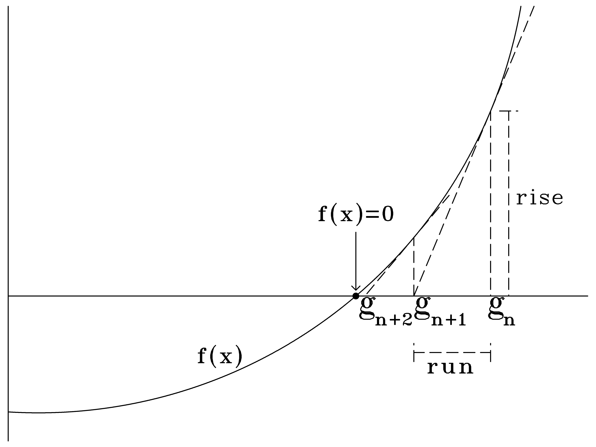

[Home](../../README.md)

# Newton's Method

Used to estimate where $f(x) = 0$

$run = g_n - g_{n+1}$

$rise = f(g_n)$

$f^1(x) = slope = \frac{rise}{run}$

$f^1(g_n) = \frac{f(g_n)}{g_n - g_{n+1}}$

Solve for $g_{n+1}$:

$\qquad (g_n - g_{n+1}) f^1(g_n) = f(g_n)$

$\qquad g_nf^1(g_n) - g_{n+1}f^1(g_n) = f(g_n)$

$\qquad -g_{n+1}f^1(g_n) = f(g_n) - g_nf^1(g_n)$

$\qquad g_{n+1}f^1(g_n) = g_nf^1(g_n) - f(g_n)$

$\qquad g_{n+1} = \frac{g_nf^1(g_n) - f(g_n)}{f^1(g_n)}$

$\qquad g_{n+1} = g_n - \frac{f(g_n)}{f^1(g_n)}$

---

## Steps:
1. Use algebra to find $f(x)$ that when equaling 0 gives you your answer
1. Find $f^1(x)$ using $f(x)$
1. Make an initial guess $g_n$ where you think $f(x)=0$ might be
1. Find the next point with $g_{n+1} = g_n - \frac{f(g_n)}{f^1(g_n)}$
1. Keep iterating points until you get the accuracy you want. More iterations equals more accuracy.

## Example:
Find what $\sqrt{2}$ equals.

Step 1:

$\qquad \sqrt{2} = x$

$\qquad 2 = x^2$

$\qquad 0 = x^2 - 2$

$\qquad f(x) = x^2 - 2$

Step 2:

$\qquad f^1(x) = 2x$

Step 3:

$\qquad g_1 = 1.5$

Step 4:

$\qquad f(g_1) = (1.5)^2 - 2 = 0.25$

$\qquad f^1(g_1) = 2(1.5) = 3$

$\qquad g_2 = 1.5 - \frac{0.25}{3} = 1.41\overline6$

Step 5:

$\qquad f(g_2) = (1.41\overline6)^2 - 2 = 0.0069\overline4$

$\qquad f^1(g_2) = 2(1.41\overline6) = 2.8\overline3$

$\qquad g_3 = 1.41\overline6 - \frac{0.0069\overline4}{2.8\overline3} = 1.414215686$

$\sqrt{2} = 1.414213562$
