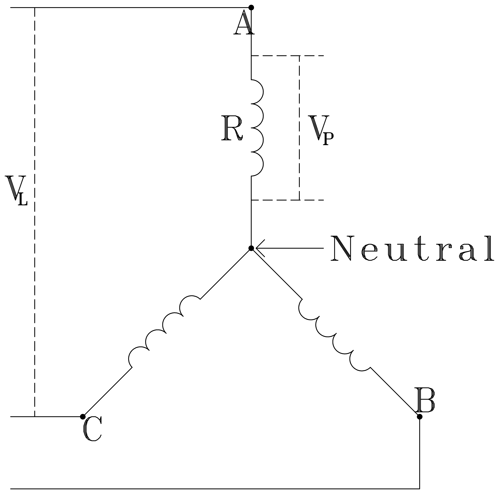
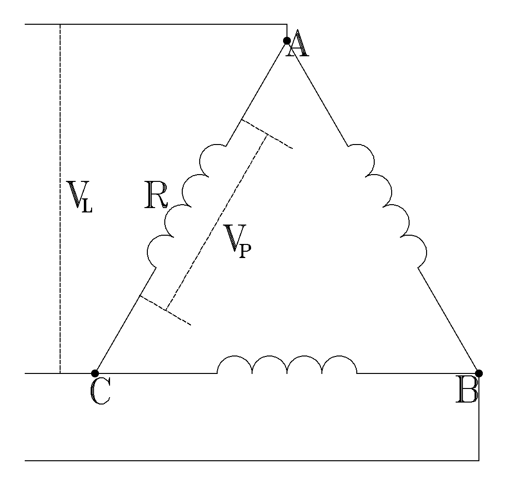
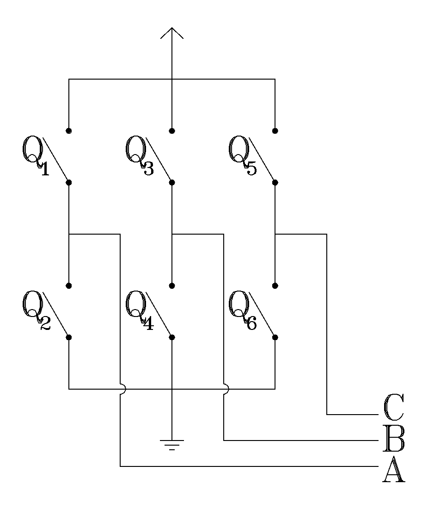
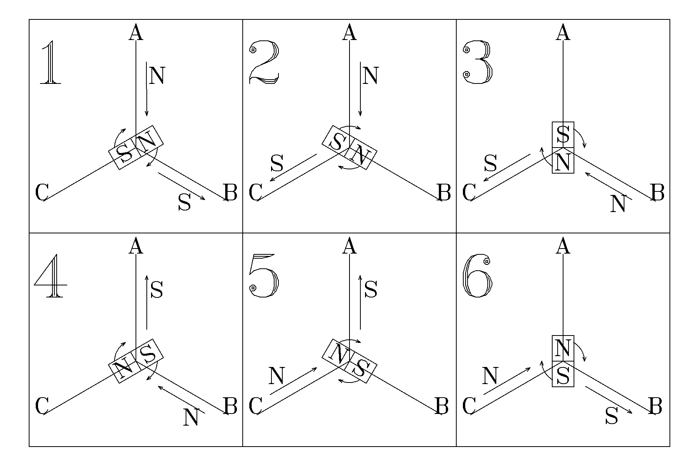
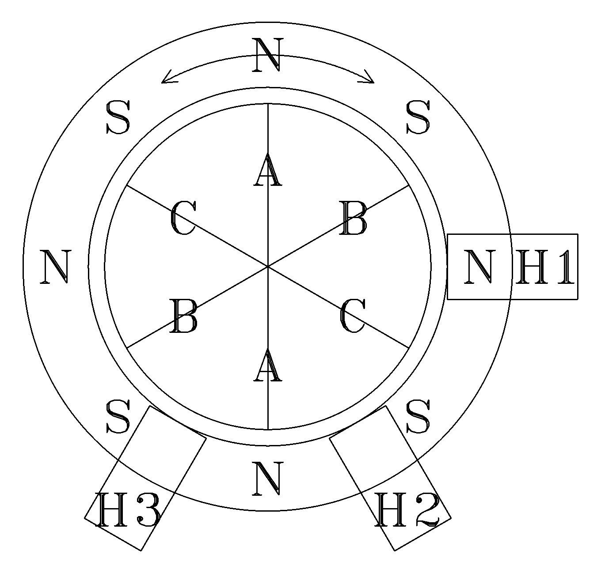
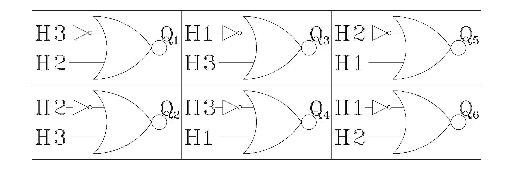

# Logic gate electronic speed controller

An electronic speed controller(ESC) that uses logic gates for the control flow instead of a micro-controller. Used to operate a brushless direct current(BLDC) motor.

## $\qquad$ Star vs Delta Configuration:

$\qquad V_L =$ Line Voltage $\qquad V_P =$ Phase Voltage

$\qquad I_L =$ Line Current $\qquad I_P =$ Phase Current

|Star|Star Equations|Delta|Delta Equations|
|:-:|:-:|:-:|:-:|
||$V_P = \frac{V_L}{\sqrt{3}}$ $I_P = \frac{V_P}{R}$ $I_L = I_P$||$V_P = V_L$ $I_P = \frac{V_P}{R}$ $I_L = I_P \sqrt{3}$|

- The force through an electromagnet is proportional to the current squared. Therefore, given the same $V_L$ and all other factors being the same the star configuration has more torque, but less RPM while the delta has more RPM, but less torque.

## $\qquad$ On and Off order:

| |1|2|3|4|5|6|
|:-:|:-:|:-:|:-:|:-:|:-:|:-:|
|High|A|A|B|B|C|C|
|Low|B|C|C|A|A|B|
|On|$Q_1/Q_4$|$Q_1/Q_6$|$Q_3/Q_6$|$Q_3/Q_2$|$Q_5/Q_2$|$Q_5/Q_4$|

| | |
|-|-|
|||

$Q_1 \ne Q_2 \qquad Q_3 \ne Q_4 \qquad Q_5 \ne Q_6 \qquad$ If these are equal there will be a short circuit.

- The switch between cycles needs to happen when the magnet is in the correct position. Either back EMF or a hall effect sensor can be used to detect the position of the magnet, however the back EMF is proportional to the RPM so can only be used at high speeds.

## $\qquad$ Placements of hall effect sensors:

There needs to be 3 hall effect sensors for A, B, and C. The number of magnets is $\frac{NumOfCoils}{3} * 4$ with the $NumOfCoils$ being a multiple of 3. The angle offset between each hall effect sensor is $\frac{360}{NumOfCoils}$.

### $\qquad\qquad$ Example with $NumOfCoils = 6$ :

| | |
|-|-|
|| The coils(A B C) and hall effect sensors(H1 H2 H3) are fixed in place while the magnets(N S) can move clockwise or counterclockwise. In order to move the magnets clockwise or counterclockwise the coils need to be set high or low in a specific order.|
- Hall effects sensors are high(1) when the northern(N) magnetic field is greater than the southern(S) magnetic field and low(0) when the southern(S) magnetic field is greater than the northern(N) magnetic field.

### $\qquad\qquad$ Clockwise
| H1 | H2 | H3 | $\rightarrow$ | Coil High/North | Coil Low/South |
|:-: |:-: |:-: |:-:            |:-:              |:-:             |
| 1  | 0  | 0  |               | B               | C              |
| 1  | 0  | 1  |               | A               | C              |
| 0  | 0  | 1  |               | A               | B              |
| 0  | 1  | 1  |               | C               | B              |
| 0  | 1  | 0  |               | C               | A              |
| 1  | 1  | 0  |               | B               | A              |

### $\qquad\qquad$ Counterclockwise
| H1 | H2 | H3 | $\rightarrow$ | Coil High/North | Coil Low/South |
|:-: |:-: |:-: |:-:            |:-:              |:-:             |
| 1  | 0  | 0  |               | C               | B              |
| 1  | 1  | 0  |               | A               | B              |
| 0  | 1  | 0  |               | A               | C              |
| 0  | 1  | 1  |               | B               | C              |
| 0  | 0  | 1  |               | B               | A              |
| 1  | 0  | 1  |               | C               | A              |

## $\qquad$ Logic gates to control the On and Off order:

### $\qquad\qquad$ Clockwise

- To reverse from clockwise to counterclockwise the inputs need to be revered.
- High(1) on a switch(Qs) closes the switch and a low(0) opens the switch.
- When a NOR gate's inputs are the same it behaves like a NOT gate thus allowing for the same NOR gate chip to be used and decreasing parts.
