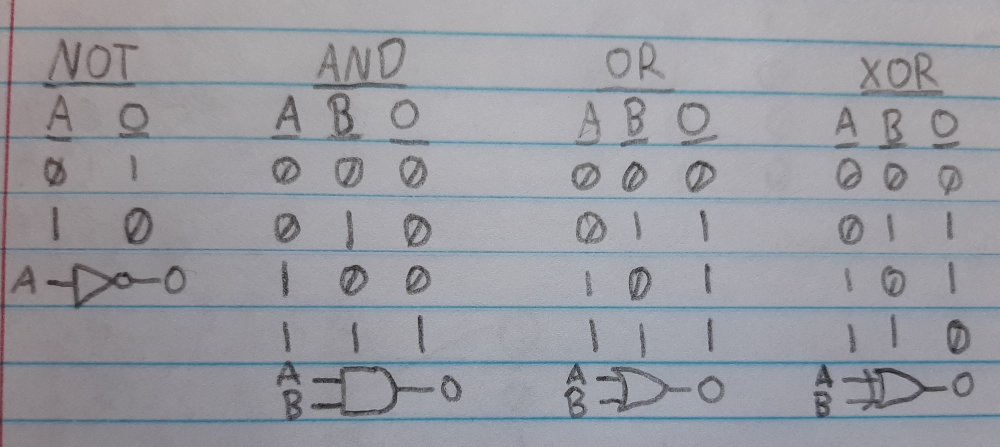
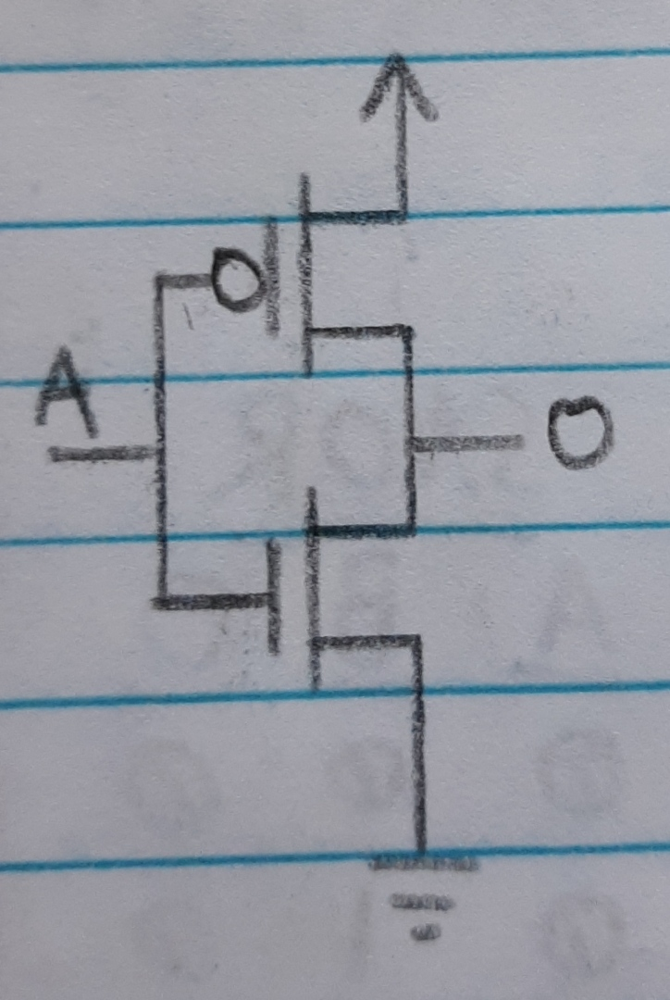
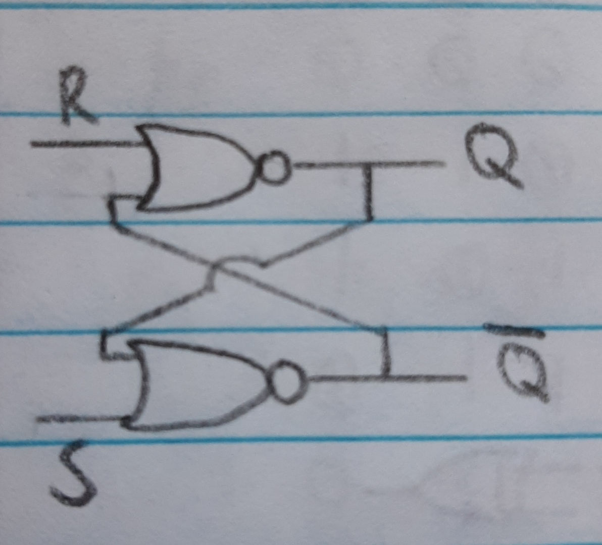
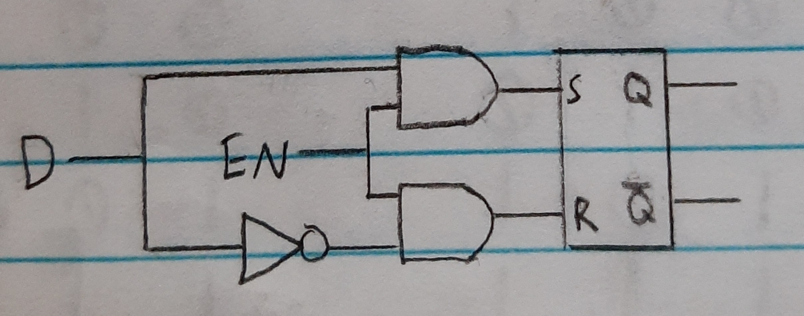
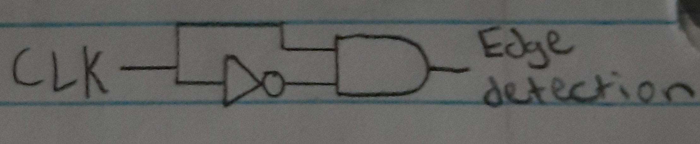

<!--
 * This file is part of RS Cheat Sheets.
 *
 * RS Cheat Sheets is free software: you can redistribute it and/or modify
 * it under the terms of the GNU General Public License as published by
 * the Free Software Foundation, either version 3 of the License, or
 * (at your option) any later version.
 *
 * RS Cheat Sheets is distributed in the hope that it will be useful,
 * but WITHOUT ANY WARRANTY; without even the implied warranty of
 * MERCHANTABILITY or FITNESS FOR A PARTICULAR PURPOSE.  See the
 * GNU General Public License for more details.
 *
 * You should have received a copy of the GNU General Public License
 * along with RS Cheat Sheets. If not, see <https://www.gnu.org/licenses/>.
 */
-->

[Home](../README.md)

# How A CPU Works
- Notes from [Ben Eater's youtube series on building an 8-bit computer](https://www.youtube.com/playlist?list=PLowKtXNTBypGqImE405J2565dvjafglHU).

## Table of Contents
<!-- TOC -->

- [How A CPU Works](#how-a-cpu-works)
	- [Table of Contents](#table-of-contents)
	- [Clock Signal](#clock-signal)
	- [Logic Gates](#logic-gates)
		- [Logic Gates from Transistors](#logic-gates-from-transistors)
	- [SR Latch](#sr-latch)
	- [D Latch and D Flip-Flop](#d-latch-and-d-flip-flop)
		- [D Latch](#d-latch)
		- [D Flip-Flop](#d-flip-flop)
			- [Edge detection circuits](#edge-detection-circuits)

<!-- /TOC -->

## [Clock Signal](#table-of-contents)
The clock signal is like the heart beat of the computer. It is a repeating pattern of high and low voltage which is used across the CPU in order to sync the execution of different components.
- Today clock signals are usually generated by a quartz crystal.
- They can also be constructed using a 555 timer as seen from Ben Eater's videos.

## [Logic Gates](#table-of-contents)
Logic gates are used to perform the logic within the computer. Modules are constructed from many of these logic gates in order to perform specialized operations.
- Everything other than the clock signal can be constructed by logic gates in a computer.

|                       |                                                    |
|-----------------------|----------------------------------------------------|
| Common gates          |           |
| Inverse gates         |          |
| Selective input gates |  |

### [Logic Gates from Transistors](#table-of-contents)
Logic gates can be created from transitions/digital switches. The most commonly used transistors are MOSFETS.

|                      |                                   |                    |                                   |
|----------------------|-----------------------------------|--------------------|-----------------------------------|
| NMOS(1 On and 0 Off) |  | PMOS(0 On and 1 Off) |  |

|     |                                       |      |                                        | | |
|-----|---------------------------------------|------|----------------------------------------|-|-|
| NOT |  | NAND |  | NOR |  |

- NAND or NOR gates can be used to construct any other logic gate.
	- Ex: XOR

## [SR Latch](#table-of-contents)
Once the SR Latch is set to 1 or 0 it maintains its state, unlike logic gates.
- Set(S) is used to latch the output(Q) to 1.
- Reset(R) is used to latch the output(Q) to 0.

| S | R | Q | !Q |
|---|---|---|----|
| 0 | 0 | Q | !Q |
| 0 | 1 | 0 | 1  |
| 1 | 0 | 1 | 0  |
| 1 | 1 | 0 | 0  |

|                                           |                                           |
|-------------------------------------------|-------------------------------------------|
|  |  |

## [D Latch and D Flip-Flop](#table-of-contents)

### [D Latch](#table-of-contents)
The D latch is a modification to the SR latch to allow for one input(D) to set and reset it. This input(D) only works when the enable pin(EN) is set.

| EN | D   | Q | !Q |
|----|-----|---|----|
| 0  | 0/1 | Q | !Q |
| 1  | 0   | 0 | 1  |
| 1  | 1   | 1 | 0  |

### [D Flip-Flop](#table-of-contents)
The D Flip-Flop is like the D Latch, but only activates when the clock signal goes from low to high.
- In order to detect when the clock goes from low to high, you need an edge detection circuit.

#### [Edge detection circuits](#table-of-contents)

1. A NOT gate can have a slight delay which can be used to create a pulse when the clock signal goes from low to high.

- You may need to use multiple NOT gates in series in order to create a significant enough delay.

2. Capacitor and resistor in series

