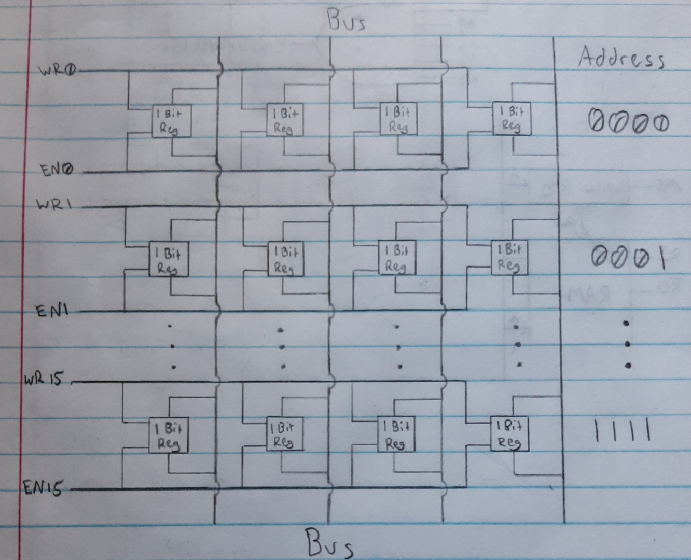
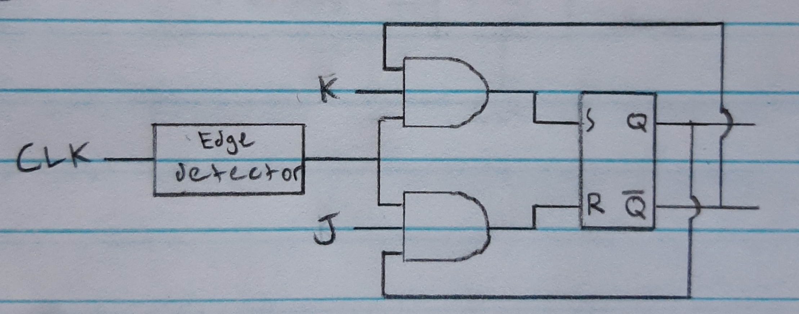

<!--
 * This file is part of RS Cheat Sheets.
 *
 * RS Cheat Sheets is free software: you can redistribute it and/or modify
 * it under the terms of the GNU General Public License as published by
 * the Free Software Foundation, either version 3 of the License, or
 * (at your option) any later version.
 *
 * RS Cheat Sheets is distributed in the hope that it will be useful,
 * but WITHOUT ANY WARRANTY; without even the implied warranty of
 * MERCHANTABILITY or FITNESS FOR A PARTICULAR PURPOSE.  See the
 * GNU General Public License for more details.
 *
 * You should have received a copy of the GNU General Public License
 * along with RS Cheat Sheets. If not, see <https://www.gnu.org/licenses/>.
 */
-->

[Home](../../README.md)

# How A CPU Works
- Notes from [Ben Eater's youtube series on building an 8-bit computer](https://www.youtube.com/playlist?list=PLowKtXNTBypGqImE405J2565dvjafglHU).

- A **word** is fixed size of data that a computer can process in a single operation.
- The **base of a computer** is the amount of bits a word is for that computer.
	- Today, the most common is base 64 where a word is 64 bits.
	- `X`s on any diagram represent the amount of connections equal to the base of the computer.
		- For example, in an 8-bit computer X represents 8 connections, or in a 64-bit computer X represents 64 connections.

<!-- TOC -->

- [Clock Signal](#clock-signal)
- [Logic Gates](#logic-gates)
	- [Logic Gates from Transistors](#logic-gates-from-transistors)
- [SR Latch](#sr-latch)
- [D Latch and D Flip-Flop](#d-latch-and-d-flip-flop)
	- [D Latch](#d-latch)
	- [D Flip-Flop](#d-flip-flop)
		- [Edge detectors](#edge-detectors)
- [Bus](#bus)
	- [Floating output/Tri state gates](#floating-outputtri-state-gates)
- [Register](#register)
- [Arithmetic logic unitALU](#arithmetic-logic-unitalu)
	- [Twos complement](#twos-complement)
	- [Full adder](#full-adder)
	- [Adder and Subtractor](#adder-and-subtractor)
- [RAM](#ram)
	- [DRAM vs SRAM](#dram-vs-sram)
	- [Address mapper/Binary Decoder](#address-mapperbinary-decoder)
	- [RAM overview](#ram-overview)
- [Program Counter](#program-counter)
	- [JK Flip Flop](#jk-flip-flop)
	- [Master Slave JK Flip Flop](#master-slave-jk-flip-flop)

<!-- /TOC -->

## [Clock Signal](#how-a-cpu-works)
The clock signal is like the heart beat of the computer. It is a repeating pattern of high and low voltage which is used across the CPU in order to sync the execution of different components.
- Today clock signals are usually generated by a quartz crystal.
- They can also be constructed using a 555 timer as seen from Ben Eater's videos.


- The HLT signal is used to stop the clock.

## [Logic Gates](#how-a-cpu-works)
Logic gates are used to perform the logic within the computer. Modules are constructed from many of these logic gates in order to perform specialized operations.
- Everything other than the clock signal can be constructed by logic gates in a computer.

|                       |                                                    |
|-----------------------|----------------------------------------------------|
| Common gates          |           |
| Inverse gates         |          |
| Selective input gates |  |

### [Logic Gates from Transistors](#how-a-cpu-works)
Logic gates can be created from transitions/digital switches. The most commonly used transistors are MOSFETS.

|                      |                                   |                    |                                   |
|----------------------|-----------------------------------|--------------------|-----------------------------------|
| NMOS(1 On and 0 Off) |  | PMOS(0 On and 1 Off) |  |

|     |                                       |      |                                        | | |
|-----|---------------------------------------|------|----------------------------------------|-|-|
| NOT |  | NAND |  | NOR |  |


- NAND or NOR gates can be used to construct any other logic gate.
	- Ex: XOR


## [SR Latch](#how-a-cpu-works)
Once the SR Latch is set to 1 or 0 it maintains its state, unlike logic gates.
- Set(S) is used to latch the output(Q) to 1.
- Reset(R) is used to latch the output(Q) to 0.

| S | R | Q       | !Q      |
|---|---|---------|---------|
| 0 | 0 | Q       | !Q      |
| 0 | 1 | 0       | 1       |
| 1 | 0 | 1       | 0       |
| 1 | 1 | Unknown | Unknown |

|                                           |                                           |
|-------------------------------------------|-------------------------------------------|
|  |  |

## [D Latch and D Flip-Flop](#how-a-cpu-works)

### [D Latch](#how-a-cpu-works)
The D latch is a modification to the SR latch to allow for one input(D) to set and reset it. This input(D) only works when the enable pin(EN) is set.

| EN | D   | Q | !Q |
|----|-----|---|----|
| 0  | 0/1 | Q | !Q |
| 1  | 0   | 0 | 1  |
| 1  | 1   | 1 | 0  |


### [D Flip-Flop](#how-a-cpu-works)
The D Flip-Flop is like the D Latch, but only activates when the clock signal goes from low to high.
- They can be used to store 1 bit of information

|                                           |                                                  |
|-------------------------------------------|--------------------------------------------------|
|  |  |

| CLK    | D   | Q | !Q |
|--------|-----|---|----|
| X      | 0/1 | Q | !Q |
| 0 to 1 | 0   | 0 | 1  |
| 0 to 1 | 1   | 1 | 0  |

#### [Edge detectors](#how-a-cpu-works)
In order to detect when the clock goes from low to high, you need an edge detection circuit.


1. A NOT gate can have a slight delay which can be used to create a pulse when the clock signal goes from low to high.


- You may need to use multiple NOT gates in series in order to create a significant enough delay.

2. Capacitor, resistor, and diode


## [Bus](#how-a-cpu-works)
A bus is used for communication between different modules of a CPU. It is a collection of wires, usually the same number as the base of the computer, which connects to all other modules.


- A module can either put data onto the bus(Enable), read memory from the bus(Load), or neither.

| Enable | Load | Description            |
|--------|------|------------------------|
| 0      | 0    | Neither/Floating       |
| 1      | 0    | Put data onto the bus  |
| 0      | 1    | Read data from the bus |
| 1      | 1    | Never used             |

- When one module puts data onto the bus and the other reads data from the bus, that module passed information to the other module.
- The CLK signal are shared between each module to allow them to be synced

### [Floating output/Tri state gates](#how-a-cpu-works)
In order to have a floating output(not set to 1 or 0) you need to decouple it from the bus.
- These are called tri-state gates

| In | En | Out           |
|----|----|---------------|
| 0  | 0  | Hi-Z/Floating |
| 1  | 0  | Hi-Z/Floating |
| 0  | 1  | 0             |
| 1  | 1  | 1             |

|                                              |                                              | |
|----------------------------------------------|----------------------------------------------|-|
|  |  |  |

## [Register](#how-a-cpu-works)
A register is a module that is used to store a word, same bits as the computer base, of memory inside the CPU.
- The D Flip-Flop is used to store one bit of information

|                                            |                                                   |
|--------------------------------------------|---------------------------------------------------|
|  |  |

- Synchronous memory only reads in memory when the clock goes from low to high.
- Asynchronous memory operates independently from the clock.

## [Arithmetic logic unit(ALU)](#how-a-cpu-works)
The arithmetic logic unit (ALU) is the module in the CPU which does mathematical and logical operations. It is connected to registers and can transfer the results to the bus.


| Input  | Description           |
|--------|-----------------------|
| **AI** | A register In/Load    |
| **AO** | A register Out/Enable |
| **EO** | Sum Out/Enable        |
| **SU** | Subtract              |
| **BI** | B register In/Load    |
| **BO** | B register Out/Enable |

- The X symbolizes the amount of connections equal to the base of the computer.

### [Twos complement](#how-a-cpu-works)
Twos complement is a protocol for converting binary numbers to base 10 numbers. This protocol allows for binary addition and subtraction to translate into base 10 addition and subtraction.
- If the leading bit is 1 then it's negative and if it's 0 it's positive.

| Binary | Base 10 | Binary | Base 10 |
|--------|---------|--------|---------|
| 1000   | -8      | 0000   | 0       |
| 1001   | -7      | 0001   | 1       |
| 1010   | -6      | 0010   | 2       |
| 1011   | -5      | 0011   | 3       |
| 1100   | -4      | 0100   | 4       |
| 1101   | -3      | 0101   | 5       |
| 1110   | -2      | 0110   | 6       |
| 1111   | -1      | 0111   | 7       |

- Ex calculation:

```
  -5  ->   1011
+  5  -> + 0101
-----    -------
   0  <-  10000

  -7  ->   1001
+  2  -> + 0010
-----    -------
  -5  <-   1011
```

To convert a number between negative and positive(and vise versa) in two's complement, you first invert all the bits and then add 1.

```
-7  ->  1001   Convert to binary
1001 -> 0110   Invert/Flip bits
0110 -> 0111   Binary Add 1
0111  -> 7     Convert to decimal
```

### [Full adder](#how-a-cpu-works)
A full adder is used to add two bits together. The Carry In(CI) input is used to allow for the inclusion of a carry bit from another addition. The Carry Out(CO) output is set to 1 when the addition results in a carry output and 0 when it's not.

|                                                |                                                 |
|------------------------------------------------|-------------------------------------------------|
|  |  |

### [Adder and Subtractor](#how-a-cpu-works)
Full adders are strung together to do addition on the full word of a computer.

- 4-bit computer adder example:


- In order to subtract(SU to 1) with the 2s compliment then you have to invert, which is done with the XORs, and then add one, which is done by connecting to the carry in(CI) input to the adder.


## [RAM](#how-a-cpu-works)
Random Access Memory (RAM) is a sequence of memory locations used to store data, usually the size of a word.

Ex: 4 bit address and 4 bit word memory. The tops and bottoms are connected to the bus with tri-state gates. Separate tri-state gates are used to determine if it should input or output to/from the bus.



- Bitlines are the input/output lines that run vertically.
- Wordlines are the read/write lines that run horizontally.

### [DRAM vs SRAM](#how-a-cpu-works)
- Dynamic RAM(DRAM)
	- Uses capacitors to store one bit
	- Requires constant refreshing. Less performant.
	- Cheaper
- Static RAM(SRAM)
	- Uses D Flip-Flops to store one bit like registers
	- Doesn't require refreshing. More performant.
	- More expensive

| DRAM                              | SRAM                                       |
|-----------------------------------|--------------------------------------------|
|  |  |

- DRAM
	- A charged capacitor represents a 1, while a discharged represents a 0.
	- Because reading the data removes the charge in the capacitor, sense amplifiers are used to detect the charge of the cap, store it in a register, and write it back to the cap so it keeps its charge.
	- Separate tri-state gates are used to determine if it should input or output to/from the bus.
	- Charged capacitors discharge over time so they have to be constantly refreshed which consists of reading in and writing the same memory back to the capacitors. There is usually done by separate circuitry.

### [Address mapper/Binary Decoder](#how-a-cpu-works)
The address mapper/binary decoder is used to map the address to the corresponding WR/EN pins. This can be done with multi-input AND gates.


- When the address is 0000 and the EN/WR pin is 1, EN0/WR0 is 1 to allow the memory to read/write onto/from the bus.
- For SRAM separate address mappers are used for WR and EN. For DRAM the WR/EN pins are connected.

### [RAM overview](#how-a-cpu-works)


- `A` is the Address size. In this CPU architecture the address size is assumed to be less than the word of the computer to allow one operation to set the address and instruction code.
- **MI** - Memory Address In
- **RI** - RAM In
- **RO** - RAM Out

## [Program Counter](#how-a-cpu-works)
The program counter counts by 1 every operation?

### [JK Flip Flop](#how-a-cpu-works)
The JK Flip Flop is like the SR Latch, but when both the inputs are high it toggles the state instead of putting it in an unknown state.

| CLK    | J   | K   | Q      | !Q     |
|--------|-----|-----|--------|--------|
| X      | 0/1 | 0/1 | Q      | !Q     |
| 0 to 1 | 0   | 0   | Q      | !Q     |
| 0 to 1 | 0   | 1   | 0      | 1      |
| 0 to 1 | 1   | 0   | 1      | 0      |
| 0 to 1 | 1   | 1   | Toggle | Toggle |



- The problem with the JK Flip Flop is that when J and K are both 1, and the CLK signal goes from 0 to 1, there's a race condition toggling the output. If Q goes to 1, that causes Q to go to 0, which causes Q to go to 1, etc until the clock pulse ends.


### [Master Slave JK Flip Flop](#how-a-cpu-works)
