[Home](../../README.md)

# How A CPU Works
- Notes from [Ben Eater's youtube series on building an 8-bit computer](https://www.youtube.com/playlist?list=PLowKtXNTBypGqImE405J2565dvjafglHU).

- A **word** is fixed size of data that a computer can process in a single operation.
- The **base of a computer** is the amount of bits a word is for that computer.
	- Today, the most common is base 64 where a word is 64 bits.
	- `X`s on any diagram represent the amount of connections equal to the base of the computer.
		- For example, in an 8-bit computer X represents 8 connections, or in a 64-bit computer X represents 64 connections.

<!-- TOC -->

- [Clock Signal](#clock-signal)
- [Logic Gates](#logic-gates)
	- [Logic Gates from Transistors](#logic-gates-from-transistors)
- [SR Latch](#sr-latch)
- [D Latch and D Flip-Flop](#d-latch-and-d-flip-flop)
	- [D Latch](#d-latch)
	- [D Flip-Flop](#d-flip-flop)
		- [Edge detectors](#edge-detectors)
- [Bus](#bus)
	- [Floating output/Tri state gates](#floating-outputtri-state-gates)
- [Register](#register)
- [Arithmetic logic unitALU](#arithmetic-logic-unitalu)
	- [Twos complement](#twos-complement)
	- [Full adder](#full-adder)
	- [Adder and Subtractor](#adder-and-subtractor)
- [RAM](#ram)
	- [DRAM vs SRAM](#dram-vs-sram)
	- [Address mapper/Binary Decoder](#address-mapperbinary-decoder)
	- [RAM overview](#ram-overview)
- [Program Counter](#program-counter)
	- [JK Flip Flop](#jk-flip-flop)
	- [Master Slave JK Flip Flop](#master-slave-jk-flip-flop)
	- [Binary Counter](#binary-counter)
	- [Program Counter Overview](#program-counter-overview)
- [Control Unit](#control-unit)
	- [Fetch, Decode, and Execute](#fetch-decode-and-execute)
	- [Conditional Jumps](#conditional-jumps)
	- [Control Signals](#control-signals)
	- [Instructions](#instructions)
- [User Input](#user-input)
- [CPU Overview](#cpu-overview)

<!-- /TOC -->

## [Clock Signal](#how-a-cpu-works)
The clock signal is like the heart beat of the computer. It is a repeating pattern of high and low voltage which is used across the CPU in order to sync the execution of different components.
- Today clock signals are usually generated by a quartz crystal.
- They can also be constructed using a 555 timer as seen from Ben Eater's videos.


- The HLT signal is used to stop the clock.

## [Logic Gates](#how-a-cpu-works)
Logic gates are used to perform the logic within the computer. Modules are constructed from many of these logic gates in order to perform specialized operations.
- Everything other than the clock signal can be constructed by logic gates in a computer.

|                       |                                                    |
|-----------------------|----------------------------------------------------|
| Common gates          |           |
| Inverse gates         |          |
| Selective input gates |  |

### [Logic Gates from Transistors](#how-a-cpu-works)
Logic gates can be created from transitions/digital switches. The most commonly used transistors are MOSFETS.

|                      |                                   |                    |                                   |
|----------------------|-----------------------------------|--------------------|-----------------------------------|
| NMOS(1 On and 0 Off) |  | PMOS(0 On and 1 Off) |  |

|     |                                       |      |                                        | | |
|-----|---------------------------------------|------|----------------------------------------|-|-|
| NOT |  | NAND |  | NOR |  |


- NAND or NOR gates can be used to construct any other logic gate.
	- Ex: XOR


## [SR Latch](#how-a-cpu-works)
Once the SR Latch is set to 1 or 0 it maintains its state, unlike logic gates.
- Set(S) is used to latch the output(Q) to 1.
- Reset(R) is used to latch the output(Q) to 0.

| S | R | Q       | !Q      |
|---|---|---------|---------|
| 0 | 0 | Q       | !Q      |
| 0 | 1 | 0       | 1       |
| 1 | 0 | 1       | 0       |
| 1 | 1 | Unknown | Unknown |

|                                           |                                           |
|-------------------------------------------|-------------------------------------------|
|  |  |

## [D Latch and D Flip-Flop](#how-a-cpu-works)

### [D Latch](#how-a-cpu-works)
The D latch is a modification to the SR latch to allow for one input(D) to set and reset it. This input(D) only works when the enable pin(EN) is set.

| EN | D   | Q | !Q |
|----|-----|---|----|
| 0  | 0/1 | Q | !Q |
| 1  | 0   | 0 | 1  |
| 1  | 1   | 1 | 0  |


### [D Flip-Flop](#how-a-cpu-works)
The D Flip-Flop is like the D Latch, but only activates when the clock signal goes from low to high.
- They can be used to store 1 bit of information

|                                           |                                                  |
|-------------------------------------------|--------------------------------------------------|
|  |  |

| CLK    | D   | Q | !Q |
|--------|-----|---|----|
| X      | 0/1 | Q | !Q |
| 0 to 1 | 0   | 0 | 1  |
| 0 to 1 | 1   | 1 | 0  |

#### [Edge detectors](#how-a-cpu-works)
In order to detect when the clock goes from low to high, you need an edge detection circuit.


1. A NOT gate can have a slight delay which can be used to create a pulse when the clock signal goes from low to high.


- You may need to use multiple NOT gates in series in order to create a significant enough delay.

2. Capacitor, resistor, and diode


## [Bus](#how-a-cpu-works)
A bus is used for communication between different modules of a CPU. It is a collection of wires, usually the same number as the base of the computer, which connects to all other modules.


- A module can either put data onto the bus(Enable), read memory from the bus(Load), or neither.

| Enable | Load | Description            |
|--------|------|------------------------|
| 0      | 0    | Neither/Floating       |
| 1      | 0    | Put data onto the bus  |
| 0      | 1    | Read data from the bus |
| 1      | 1    | Never used             |

- When one module puts data onto the bus and the other reads data from the bus, that module passed information to the other module.
- The CLK signal are shared between each module to allow them to be synced

### [Floating output/Tri state gates](#how-a-cpu-works)
In order to have a floating output(not set to 1 or 0) you need to decouple it from the bus.
- These are called tri-state gates

| In | En | Out           |
|----|----|---------------|
| 0  | 0  | Hi-Z/Floating |
| 1  | 0  | Hi-Z/Floating |
| 0  | 1  | 0             |
| 1  | 1  | 1             |

|                                              |                                              | |
|----------------------------------------------|----------------------------------------------|-|
|  |  |  |

## [Register](#how-a-cpu-works)
A register is a module that is used to store a word, same bits as the computer base, of memory inside the CPU.
- The D Flip-Flop is used to store one bit of information

|                                            |                                                   |
|--------------------------------------------|---------------------------------------------------|
|  |  |

- Synchronous memory only reads in memory when the clock goes from low to high.
- Asynchronous memory operates independently from the clock.

## [Arithmetic logic unit(ALU)](#how-a-cpu-works)
The arithmetic logic unit (ALU) is the module in the CPU which does mathematical and logical operations. It is connected to registers and can transfer the results to the bus.


- The `X` symbolizes the amount of connections equal to the base of the computer.

| Control Signal | Description           |
|----------------|-----------------------|
| **AI**         | A register In/Load    |
| **AO**         | A register Out/Enable |
| **CY**         | Carry Bit             |
| **EO**         | Sum Out/Enable        |
| **SU**         | Subtract              |
| **BI**         | B register In/Load    |
| **BO**         | B register Out/Enable |


### [Twos complement](#how-a-cpu-works)
Twos complement is a protocol for converting binary numbers to base 10 numbers. This protocol allows for binary addition and subtraction to translate into base 10 addition and subtraction.
- If the leading bit is 1 then it's negative and if it's 0 it's positive.

| Binary | Base 10 | Binary | Base 10 |
|--------|---------|--------|---------|
| 1000   | -8      | 0000   | 0       |
| 1001   | -7      | 0001   | 1       |
| 1010   | -6      | 0010   | 2       |
| 1011   | -5      | 0011   | 3       |
| 1100   | -4      | 0100   | 4       |
| 1101   | -3      | 0101   | 5       |
| 1110   | -2      | 0110   | 6       |
| 1111   | -1      | 0111   | 7       |

- Ex calculation:

```
  -5  ->   1011
+  5  -> + 0101
-----    -------
   0  <-  10000

  -7  ->   1001
+  2  -> + 0010
-----    -------
  -5  <-   1011
```

To convert a number between negative and positive(and vise versa) in two's complement, you first invert all the bits and then add 1.

```
-7  ->  1001   Convert to binary
1001 -> 0110   Invert/Flip bits
0110 -> 0111   Binary Add 1
0111  -> 7     Convert to decimal
```

### [Full adder](#how-a-cpu-works)
A full adder is used to add two bits together. The Carry In(CI) input is used to allow for the inclusion of a carry bit from another addition. The Carry Out(CO) output is set to 1 when the addition results in a carry output and 0 when it's not.

|                                                |                                                 |
|------------------------------------------------|-------------------------------------------------|
|  |  |

### [Adder and Subtractor](#how-a-cpu-works)
Full adders are strung together to do addition on the full word of a computer.

- 4-bit computer adder example:


- In order to subtract(SU to 1) with the 2s compliment then you have to invert, which is done with the XORs, and then add one, which is done by connecting to the carry in(CI) input to the adder.


## [RAM](#how-a-cpu-works)
Random Access Memory (RAM) is a sequence of memory locations used to store data, usually the size of a word.
- The code that is executed by the CPU is stored in the RAM.

Ex: 4 bit address and 4 bit word memory. The tops and bottoms are connected to the bus with tri-state gates. Separate tri-state gates are used to determine if it should input or output to/from the bus.


- Bitlines are the input/output lines that run vertically.
- Wordlines are the read/write lines that run horizontally.

### [DRAM vs SRAM](#how-a-cpu-works)
- Dynamic RAM(DRAM)
	- Uses capacitors to store one bit
	- Requires constant refreshing. Less performant.
	- Cheaper
- Static RAM(SRAM)
	- Uses D Flip-Flops to store one bit like registers
	- Doesn't require refreshing. More performant.
	- More expensive

| DRAM                              | SRAM                                       |
|-----------------------------------|--------------------------------------------|
| 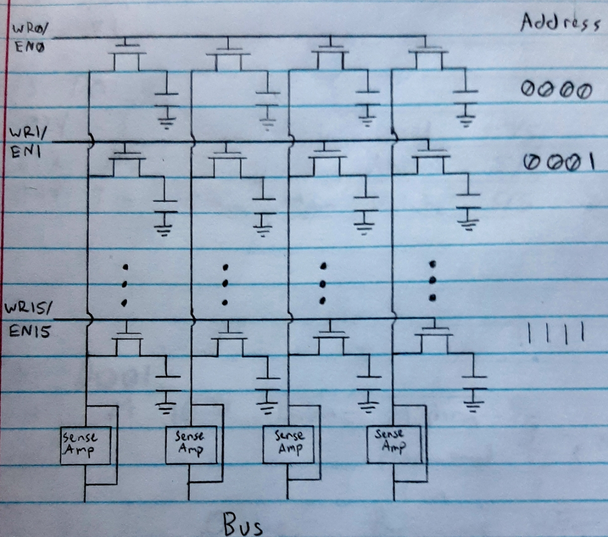 |  |

- DRAM
	- A charged capacitor represents a 1, while a discharged represents a 0.
	- Because reading the data removes the charge in the capacitor, sense amplifiers are used to detect the charge of the cap, store it in a register, and write it back to the cap so it keeps its charge.
	- Separate tri-state gates are used to determine if it should input or output to/from the bus.
	- Charged capacitors discharge over time so they have to be constantly refreshed which consists of reading in and writing the same memory back to the capacitors. There is usually done by separate circuitry.

### [Address mapper/Binary Decoder](#how-a-cpu-works)
The address mapper/binary decoder is used to map the address to the corresponding WR/EN pins. This can be done with multi-input AND gates.

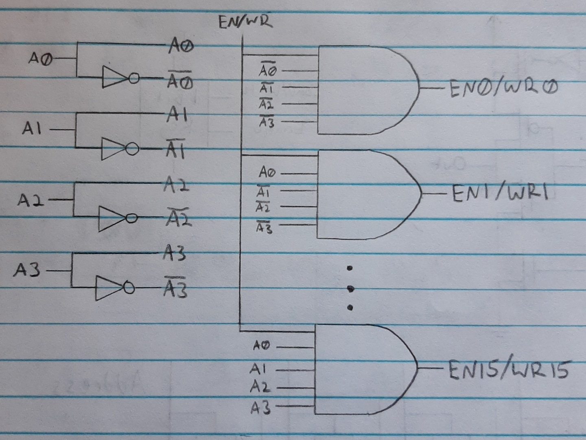

- When the address is 0000 and the EN/WR pin is 1, EN0/WR0 is 1 to allow the memory to read/write onto/from the bus.
- For SRAM separate address mappers are used for WR and EN. For DRAM the WR/EN pins are connected.

### [RAM overview](#how-a-cpu-works)

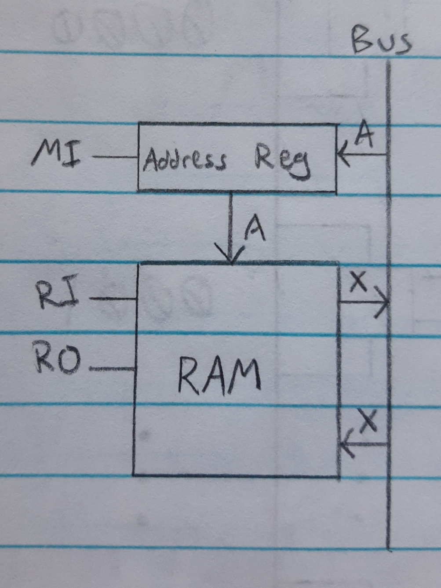

- `A` is the Address size. In this CPU architecture the address size is assumed to be less than the word of the computer to allow one operation to set the address and instruction code.

| Control Signal | Description       |
|----------------|-------------------|
| **MI**         | Memory Address In |
| **RI**         | RAM In            |
| **RO**         | RAM Out           |

## [Program Counter](#how-a-cpu-works)
The program counter is used to keep track of which address in RAM is being currently ran.

### [JK Flip Flop](#how-a-cpu-works)
The JK Flip Flop is like the SR Latch, but when both the inputs are high it toggles the state instead of putting it in an unknown state.

| CLK    | J   | K   | Q      | !Q     |
|--------|-----|-----|--------|--------|
| X      | 0/1 | 0/1 | Q      | !Q     |
| 0 to 1 | 0   | 0   | Q      | !Q     |
| 0 to 1 | 0   | 1   | 0      | 1      |
| 0 to 1 | 1   | 0   | 1      | 0      |
| 0 to 1 | 1   | 1   | Toggle | Toggle |


- The problem with the JK Flip Flop is that when J and K are both 1, and the CLK signal goes from 0 to 1, there's a race condition toggling the output. If Q goes to 1, that causes Q to go to 0, which causes Q to go to 1, etc until the clock pulse ends.

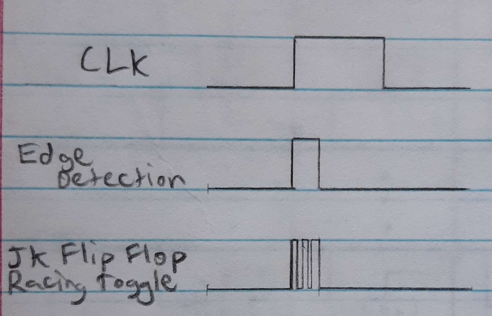

### [Master Slave JK Flip Flop](#how-a-cpu-works)
The Master Slave JK Flip Flop is used to solve this race condition problem with the toggle.

|                                                        |                                                               |
|--------------------------------------------------------|---------------------------------------------------------------|
| 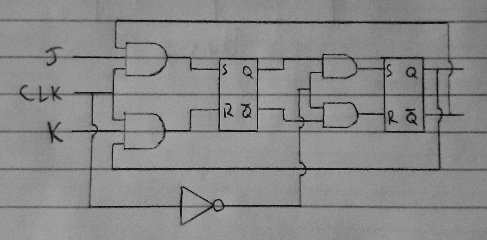 | 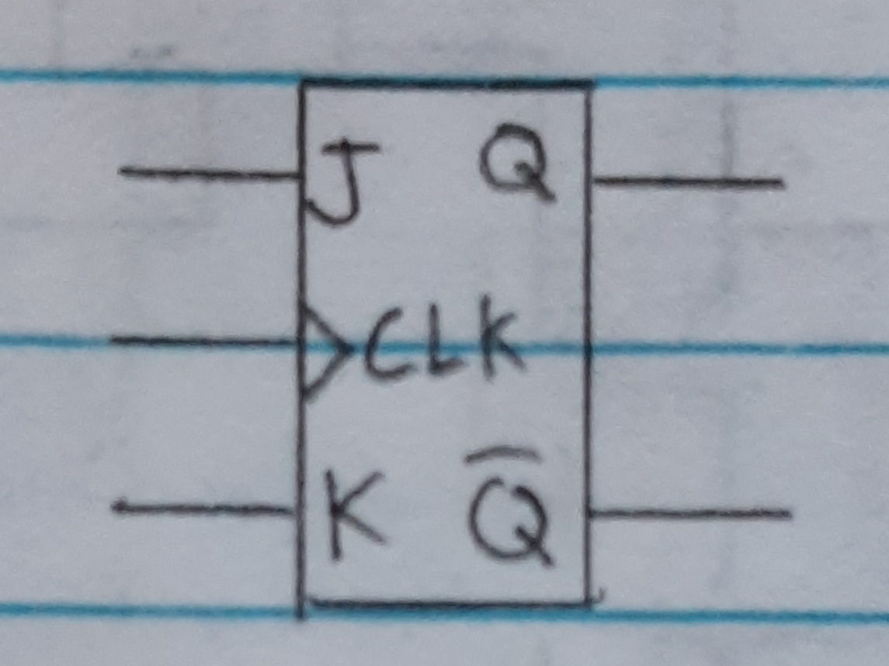 |

- When the CLK goes from 1 to 0, the 2nd SR latch is set.
- When J and K are 1, Q toggles on and off with the CLK signal. This has the same effect as dividing the CLK frequency by 2.

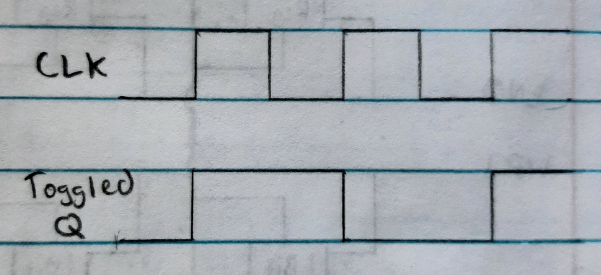

### [Binary Counter](#how-a-cpu-works)
The binary counter is used to count 1, in binary, whenever the CLK goes from low to high.


| Bit4  | Bit3  | Bit2  | Bit1  |
|-------|-------|-------|-------|
| $2^3$ | $2^2$ | $2^1$ | $2^0$ |
| 0     | 0     | 0     | 0     |
| 0     | 0     | 0     | 1     |
| 0     | 0     | 1     | 0     |
| 0     | 0     | 1     | 1     |
| 0     | 1     | 0     | 0     |
| etc   | etc   | etc   | etc   |

- The CLK signal is inverted so it counts when going from low to high instead of the usual high to low.

### [Program Counter Overview](#how-a-cpu-works)

|                                                       |                                                       |
|-------------------------------------------------------|-------------------------------------------------------|
| 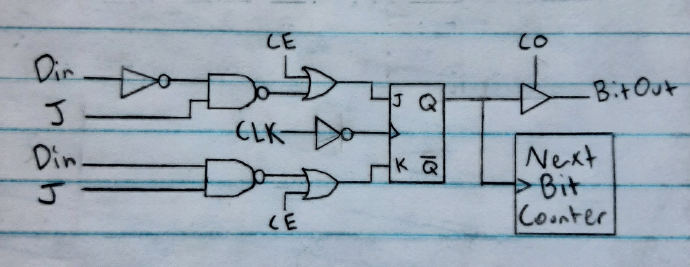 | 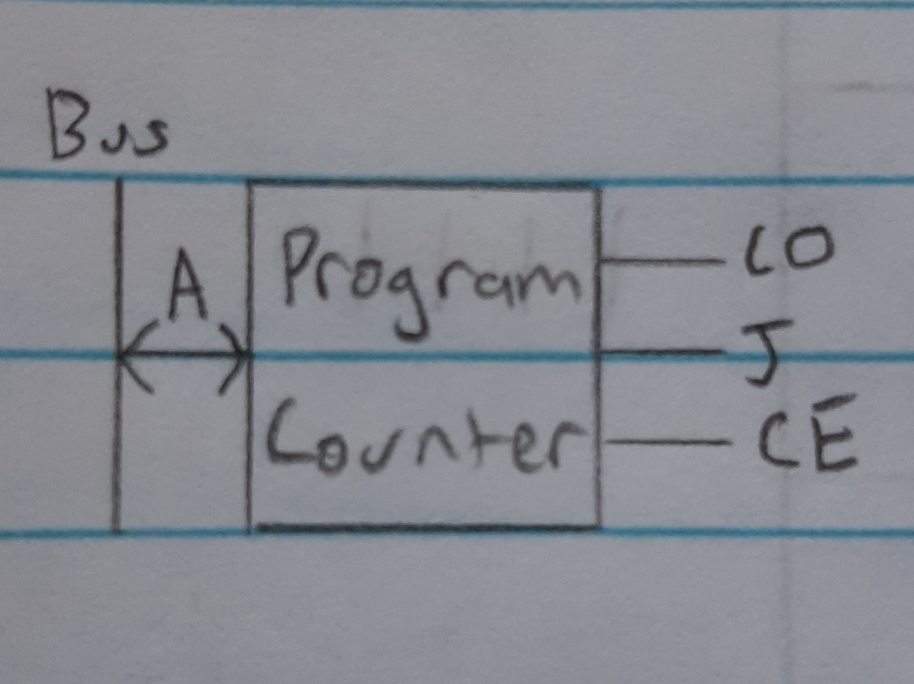 |

| Control Signal | Description             |
|----------------|-------------------------|
| **CO**         | Program Counter Out     |
| **CI/J**       | Program Counter In/Jump |
| **CE**         | Count enable/Increment  |

## [Control Unit](#how-a-cpu-works)
The control unit gets a CPU instruction, from the instruction register, and the step count, from the step counter, and outputs the correct control signals to execute that micro-instruction in the CPU.
- You can use a sequence of logic gates to do this mapping, commonly called combinational logic circuits, but that tends to require a lot of logic gates. You can instead use Electronically Erasable Programmable Read Only Memory(EEPROMs). They are like a large programmable truth table.

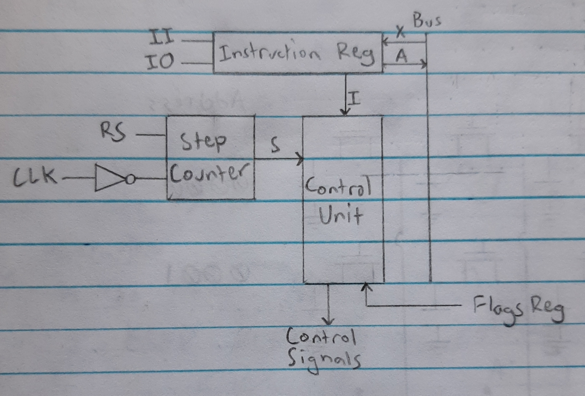

- The `I` symbolizes the amount of bits used to represent the instruction #. For this CPU, the instructions take up 4 bits.
- The `S` symbolizes the number of bits used to represent how many steps are necessary to execute an instruction. This is usually 3 bits.
- The control unit needs a separate binary counter, called the step counter, to track the current step for the instruction it’s executing.

### [Fetch, Decode, and Execute](#how-a-cpu-works)
The Fetch, Decode, and Execute are the steps that need to be taken in order to run code on the CPU. The code is stored in order in RAM. The program counter is used to store the current instruction that needs to be executed.

1. **Fetch** the current instruction in RAM and put it in the instruction register.
	1. Move the new instruction location into the RAM Address.
		- Program Counter Out(**CO**), Memory Address In(**MI**)
	2. Move the contents of RAM into the instruction register
		- RAM Out(**RO**), Instruction Register In(**II**)
	3. Increment the program counter for the next fetch
		- Increment Program Counter(**CE**)
2. The control unit **decodes** the instruction in the instruction register into the appropriate control signals.
	- This happens between clock cycles.
3. **Execute** the instruction

### [Conditional Jumps](#how-a-cpu-works)
To make a CPU Turing complete, meaning it can compute any algorithm given enough time and memory, it must have a feedback mechanism. This mechanism involves checking the results of a computation and determining the next code to execute based upon those results. Conditional jumps allow for this feedback mechanism. They jump the program counter based upon the results of different flags.
- **All 0s flag** - Is set to 1 when the ALU output is set to all 0s
	- This can be used to check if the A register is **equal to** a certain value by first loading the value in the B register and then subtracting it from the A register. If the All 0s flag is set, then they are equal.

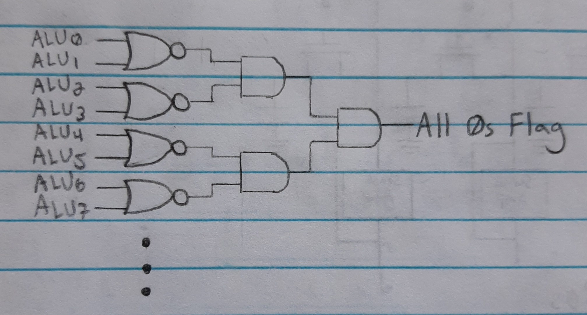

- **Negative flag** - Is set to 1 when the ALU output is negative.
	- This can be used to check if the A register is **less than** a certain value by first loading the value in the B register and then subtracting it from the A register. If the negative flag is set then the value in A is less than the value in B.
	- This flag can be gotten by getting the last bit of the ALU.
- **Carry flag** - Is set to 1 when the result of the ALU produces a carry bit.

The flags need their own register to make sure they are saved before the calculation is put back in the A register.

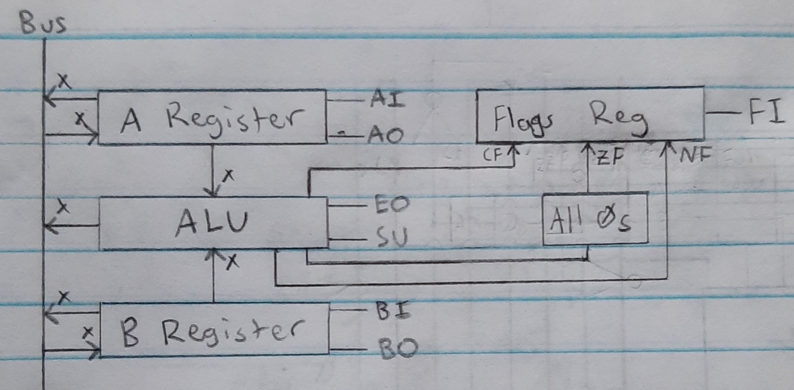

| Flag    | Description    |
|---------|----------------|
| **CF**  | Carry Flag     |
| **ZF**  | Zero Flag      |
| **NF**  | Negative Flag  |

### [Control Signals](#how-a-cpu-works)

| Control Signal | Description                      |
|----------------|----------------------------------|
| **HT**         | Halt                             |
| **MI**         | Memory Address In                |
| **RI**         | RAM In                           |
| **RO**         | RAM Out                          |
| **II**         | Instruction Register In          |
| **IO**         | Instruction Register Out         |
| **AI**         | A Register In                    |
| **AO**         | A Register Out                   |
| **EO**         | Sum Out                          |
| **SU**         | Subtract                         |
| **BI**         | B Register In                    |
| **BO**         | B Register Out                   |
| **OI**         | Output Register In               |
| **CE**         | Program Counter Enable/Increment |
| **CO**         | Program Counter Out              |
| **CI**         | Program Counter In/Jump          |
| **UO**         | User Input Register In           |
| **FI**         | Flags Register In                |
| **RS**         | Reset Step Counter               |

### [Instructions](#how-a-cpu-works)
The instructions are programed into the Control Unit. They can be whatever the CPU designer wants them to be.
- The Instruction #, Step Counter, and the flags are the inputs into the control unit
- The Control Signals are the output from the control unit. The other control signals are set to 0 when they aren't set

| Name                       | Instruction     | Instruction # | Step Counter | CF | ZF | NF | Control Signal |
|----------------------------|-----------------|---------------|--------------|----|----|----|----------------|
| Fetch                      |                 | ----          | 000          | -  | -  | -  | CO, MI         |
|                            |                 | ----          | 001          | -  | -  | -  | RO, II, CE     |
| No Operation               | NOP             | 0000          | 010          | -  | -  | -  |                |
|                            |                 |               | 011          | -  | -  | -  | RS             |
| Load A register            | LDA Address     | 0001          | 010          | -  | -  | -  | IO, MI         |
|                            |                 |               | 011          | -  | -  | -  | RO, AI         |
|                            |                 |               | 100          | -  | -  | -  | RS             |
| Add to A register          | ADD Address     | 0010          | 010          | -  | -  | -  | IO, MI         |
|                            |                 |               | 011          | -  | -  | -  | RO, BI         |
|                            |                 |               | 100          | -  | -  | -  | EO, AI, FI     |
|                            |                 |               | 101          | -  | -  | -  | RS             |
| Subtract from A register   | SUB Address     | 0011          | 010          | -  | -  | -  | IO, MI         |
|                            |                 |               | 011          | -  | -  | -  | RO, BI         |
|                            |                 |               | 100          | -  | -  | -  | EO, AI, SU, FI |
|                            |                 |               | 101          | -  | -  | -  | RS             |
| Store A register in RAM    | STA Address     | 0100          | 010          | -  | -  | -  | IO, MI         |
|                            |                 |               | 011          | -  | -  | -  | AO, RI         |
|                            |                 |               | 100          | -  | -  | -  | RS             |
| Load Literal in A Register | LDL Literal     | 0101          | 010          | -  | -  | -  | IO, AI         |
|                            |                 |               | 011          | -  | -  | -  | RS             |
| Jump Program Counter       | JMP Address     | 0110          | 010          | -  | -  | -  | IO, CI         |
|                            |                 |               | 011          | -  | -  | -  | RS             |
| Jump if Carry Flag         | JC Address      | 0111          | 010          | 1  | -  | -  | IO, CI         |
|                            |                 |               | 010          | 0  | -  | -  |                |
|                            |                 |               | 011          | -  | -  | -  | RS             |
| Jump if Not Carry Flag     | JNC Address     | 1000          | 010          | 0  | -  | -  | IO, CI         |
|                            |                 |               | 010          | 1  | -  | -  |                |
|                            |                 |               | 011          | -  | -  | -  | RS             |
| Jump if Zero/Equal         | JZ/JE Address   | 1001          | 010          | -  | 1  | -  | IO, CI         |
|                            |                 |               | 010          | -  | 0  | -  |                |
|                            |                 |               | 011          | -  | -  | -  | RS             |
| Jump if Not Zero/Not Equal | JNZ/JNE Address | 1010          | 010          | -  | 0  | -  | IO, CI         |
|                            |                 |               | 010          | -  | 1  | -  |                |
|                            |                 |               | 011          | -  | -  | -  | RS             |
| Jump if Negative           | JN Address      | 1011          | 010          | -  | -  | 1  | IO, CI         |
|                            |                 |               | 010          | -  | -  | 0  |                |
|                            |                 |               | 011          | -  | -  | -  | RS             |
| Jump if Positive           | JP Address      | 1100          | 010          | -  | -  | 0  | IO, CI         |
|                            |                 |               | 010          | -  | -  | 1  |                |
|                            |                 |               | 011          | -  | -  | -  | RS             |
| Compare A and B Register   | CMP Address     | 1101          | 010          | -  | -  | -  | IO, MI         |
|                            |                 |               | 011          | -  | -  | -  | RO, BI         |
|                            |                 |               | 100          | -  | -  | -  | FI             |
|                            |                 |               | 101          | -  | -  | -  | RS             |
| Output A Register          | OUT             | 1110          | 010          | -  | -  | -  | AO, OI         |
|                            |                 |               | 011          | -  | -  | -  | RS             |
| Halt CPU                   | HLT             | 1111          | 010          | -  | -  | -  | HT             |

- The CMP instruction is used to set the flags without changing the A register. It is common to do CMP before conditional jump instructions.

## [User Input](#how-a-cpu-works)
To get user input while the CPU is running, the user's device can set an interrupt flag, which triggers the execution of code for handling user input. For example, if the user presses a key on the keyboard, the CPU receives an interrupt flag and executes the corresponding keyboard code. Once finished, it then continues from where it left off.

## [CPU Overview](#how-a-cpu-works)

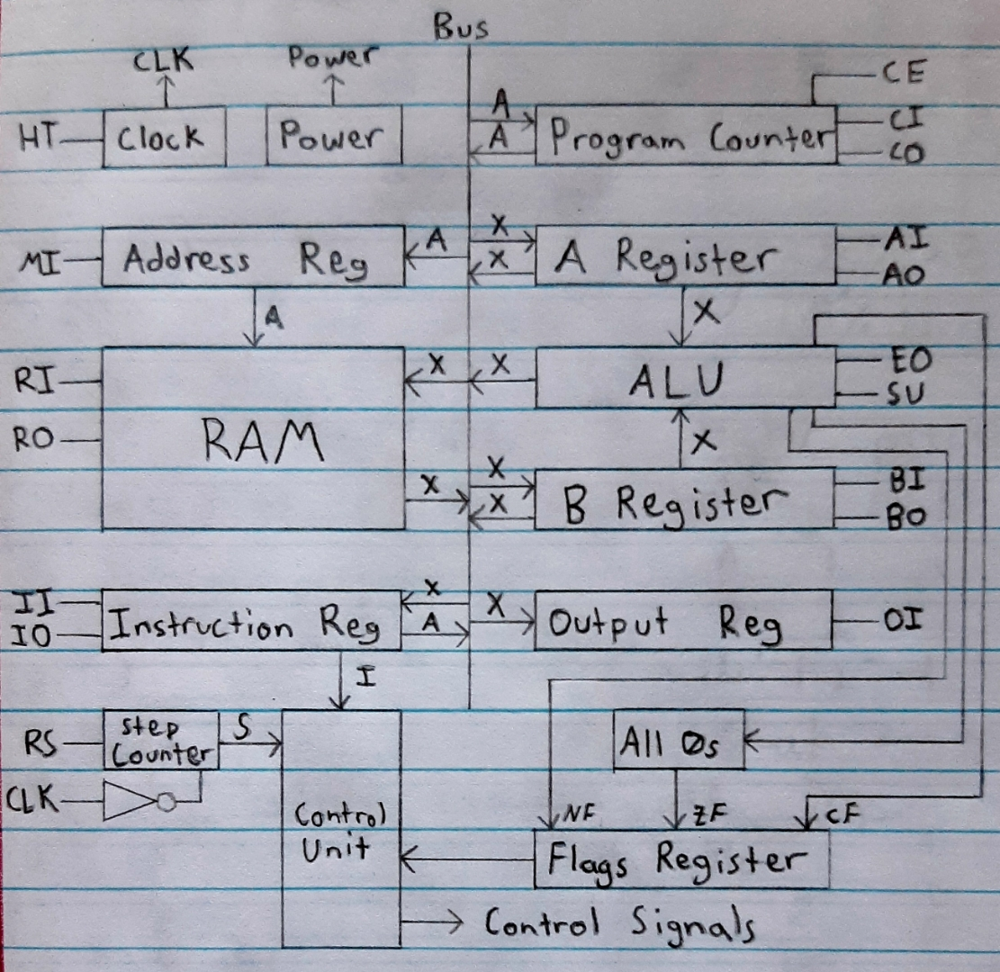

