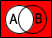
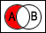
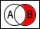

[Home](../../README.md)

# Probability
Some basic probability concepts.

<!-- TOC -->

- [Probability Logic](#probability-logic)
- [Law of Large Numbers](#law-of-large-numbers)
- [Conditional Probability](#conditional-probability)
- [Bayes Theorem](#bayes-theorem)
	- [Example:](#example)

<!-- /TOC -->

## [Probability Logic](#probability)

| Name               | Calculation                                      | Venn Diagram          | Description                         |
|--------------------|--------------------------------------------------|-----------------------|-------------------------------------|
| A Not/A Complement | 1 - P(A) = P(A')                                 |  |                                     |
| B Not/B Complement | 1 - P(B) = P(B')                                 |  |                                     |
| And/Intersection   | P(A) * P(B) = P(A &cap; B)                       |      | Probability of A and B              |
| Or/Union           | P(A) + P(B) - (P(A) * P(B)) = P(A &cup; B)       |        | Probability of A or B or both       |
| Xor                | P(A) + P(B) - (2 * P(A) * P(B)) = P(A &Delta; B) |      | Probability of A or B, but not both |
| Neither nor        | 1 - P(A &cup; B) = P((A &cup; B)')               |        | Probability fo neither A nor B      |
| A Not B            | P(A) * P(B')                                     |  | Probability of A, but not B         |
| B Not A            | P(B) * P(A')                                     |  | Probability of B, but not A         |

## [Law of Large Numbers](#probability)
A the number of outcomes for a probabilistic event goes to infinity the outcomes get closer and closer to the true probability of that event.

Ex: If you flip a coin an infinite amount of times, 50% of the outcomes will be heads and 50% tails.

## [Conditional Probability](#probability)
If P(A) = P(A\|B) then B doesn't effect the probability of A.

If P(B) = P(B\|A) then A doesn't effect the probability of B.

| Name        | Calculation                           | Description                             |
|-------------|---------------------------------------|-----------------------------------------|
| Conditional | $\frac{P(A &cap; B)}{P(B)}$ = P(A\|B) | Probability of A given that B happened. |

## [Bayes Theorem](#probability)
Bayes theorem is a formula that is used to help you update your believes based upon new evidence. New evidence shouldn't determine your believes, but update your already existing believes.

| Symbol  | Description                                        |
|---------|----------------------------------------------------|
| P(A)    | Probability of A being true before the evidence.   |
| P(B)    | Probability of B being true before the evidence.   |
| P(E\|A) | Probability of the event happening given A is true |
| P(E\|B) | Probability of the event happening given B is true |
| P(A\|E) | Probability of A given the event                   |
| P(B\|E) | Probability of B given the event                   |

P(A) = P(B') and P(B) = P(A')

P(A\|E) = P(B\|E') and P(B\|E) = P(A\|E')

$P(A\|E) = \frac{P(A) * P(E\|A)}{P(A) * P(E\|A) + P(B) * P(E\|B)}$

### [Example:](#probability)
There is a meek and tidy person. Are they more likely to be a librarian or a farmer?
- Most people assume they are more likely to be a librarian because they are meek and tidy, however they don't consider there are more farmers than librarians.

A = Librarian
B = Farmer
E = They are a meek and tidy person

| Symbol  | Description                                                   | Estimated value | Estimated Description                           |
|---------|---------------------------------------------------------------|-----------------|-------------------------------------------------|
| P(A)    | Probability of them being a librarian                         | 1/21            | There are 21 times more farmers than librarians |
| P(B)    | Probability of them being a farmer                            | 20/21           |                                                 |
| P(E\|A) | Probability of someone who is meek and tidy being a librarian | 4/10            | 40% of librarians are meek and tidy             |
| P(E\|B) | Probability of someone who is meek and tidy being a farmer    | 1/10            | 10% of farmers are meek and tidy                |

What is P(A\|E)? What's the probability of the meek and tidy person being a librarian?

$P(A\|E) = \frac{.04761 * .4}{.04761 * .4 + .95239 * .1} = .16667$

or

$P(A\|E) = \frac{1 * .4}{1 * .4 + (21 - 1) * .1} = .16667$

Even if librarians are 4 times more likely to be meek and tidy, it doesn't mean that the person is more likely a librarian.